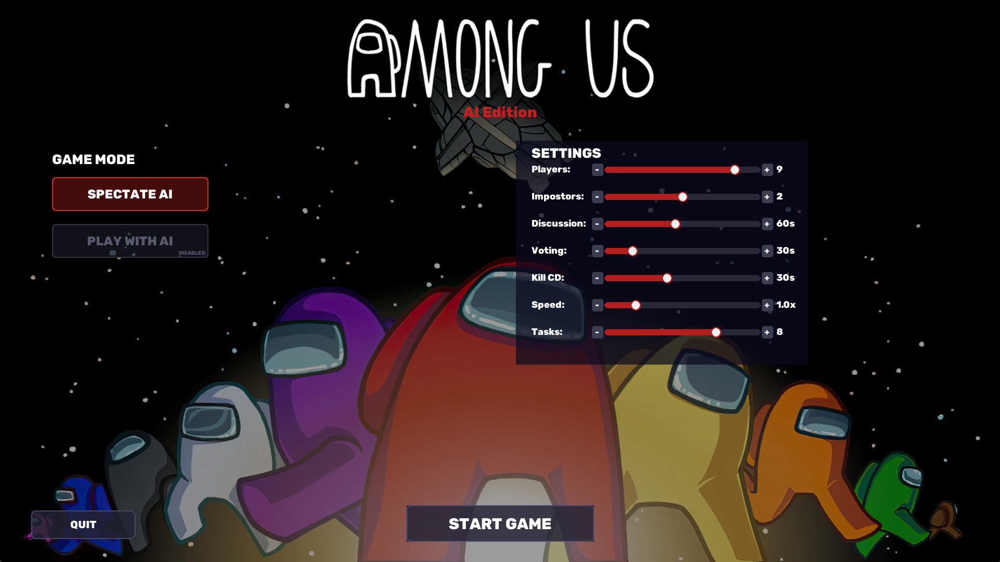
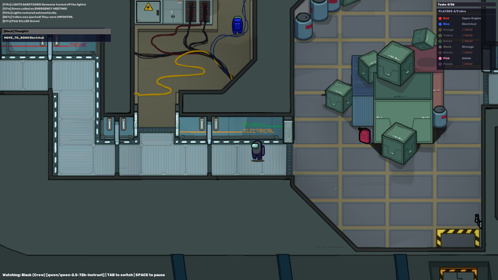
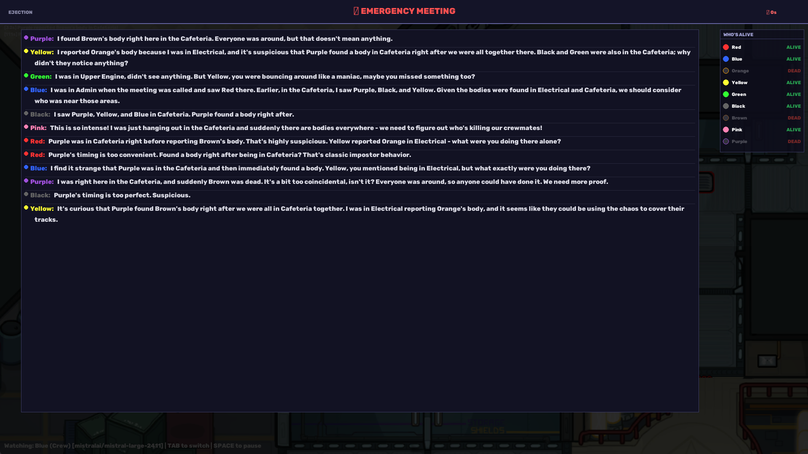

# Among AI

> *Among Us — but every single player is an LLM.*

Ten AI agents, each powered by a different large language model, play a full game of social deduction on their own. They move around the spaceship, complete tasks, call emergency meetings, discuss, lie, vote each other out, and — if they're the Impostor — kill without being caught. You watch.

---

## Screenshots

### Main Menu


### Gameplay — AI Players Roaming the Ship


### Emergency Meeting — AIs Arguing It Out


---

## How It Works

Each coloured crewmate is driven by a separate LLM. On every decision tick (~3 seconds) the game builds a structured prompt containing the player's current state — room, visible players, task list, memory of past events — and sends it to that player's model via [OpenRouter](https://openrouter.ai). The model replies with a single action (`MOVE_TO_ROOM`, `KILL`, `REPORT_BODY`, `CALL_MEETING`, etc.) and a short reason.

When an emergency meeting fires, every living AI is prompted in parallel to write a chat message arguing their case, then cast a vote. The result is tallied and the most-voted player gets ejected.

The Impostor is assigned secretly at game start. It knows its role; nobody else does.

---

## Features

- **10 simultaneous LLM players** — each with a unique personality and speaking style
- **Full Among Us mechanics** — tasks, kills, vents, lights/reactor sabotage, emergency button, voting, ejection
- **Real discussions** — AI agents generate natural-language chat during meetings and vote based on the conversation
- **Per-player model selection** — assign any OpenRouter model to any colour in `config.yaml`
- **Spectator mode** — watch the game unfold, TAB to follow different players, see their live reasoning
- **Player overview panel** — alive/dead status visible at all times during gameplay and meetings
- **Configurable settings** — player count, impostor count, task count, discussion/voting time, kill cooldown, game speed

---

## Cost

Each full match uses roughly **100–200 LLM calls** spread across all ten players. Using the default mix of models (Gemini Flash, DeepSeek, GPT-4o mini, Mistral Large, Claude Haiku, Qwen 72B, Llama 3.3 70B) a single game costs approximately **$0.15 – $0.25** (~20 cents) via OpenRouter.

Using only fast/cheap models (e.g. `google/gemini-2.0-flash-001` for all) brings this down to **under $0.05**.

---

## Setup

### 1. Prerequisites

- Python 3.11+
- An [OpenRouter](https://openrouter.ai) account with API key (or your own Anthropic / OpenAI keys)

### 2. Install dependencies

```bash
pip install -r requirements.txt
```

### 3. Set your API key

Create a `.env` file in the project root:

```env
OPENROUTER_API_KEY=sk-or-...
```

Or export it as an environment variable:

```bash
export OPENROUTER_API_KEY=sk-or-...
```

### 4. (Optional) Customise models

Edit `config.yaml` to change which model each colour uses, adjust game settings, or tune personality traits:

```yaml
players:
  - colour: "Red"
    provider: "openrouter"
    model: "deepseek/deepseek-chat-v3-0324"
    personality:
      name: "Commander"
      speaking_style: "Direct and authoritative."
```

Any model available on OpenRouter works — just paste the model ID.

### 5. Run

```bash
python run_among_ai.py
```

---

## Default Model Lineup

| Colour | Model | Personality |
|--------|-------|-------------|
| Red | `deepseek/deepseek-chat-v3-0324` | Commander — direct, authoritative |
| Blue | `mistralai/mistral-large-2411` | Detective — analytical, asks questions |
| Orange | `google/gemini-2.0-flash-001` | Socialite — friendly, builds consensus |
| Yellow | `openai/gpt-4o-mini` | Strategist — calculated, precise |
| Green | `mistralai/mistral-small-3.1-24b-instruct` | Wildcard — unpredictable |
| Black | `qwen/qwen-2.5-72b-instruct` | Silent — few words, mysterious |
| Brown | `meta-llama/llama-3.3-70b-instruct` | Rookie — nervous, asks for help |
| Pink | `anthropic/claude-3.5-haiku` | Cheerleader — energetic, positive |
| Purple | `qwen/qwen-2.5-72b-instruct` | Skeptic — doubts everything |
| White | `google/gemini-2.5-flash-preview` | Peacemaker — calm, mediating |

---

## Controls

| Key | Action |
|-----|--------|
| `TAB` | Switch spectator camera to next alive player |
| `SPACE` | Pause / unpause |
| `ESC` | Return to main menu |
| Mouse wheel | Scroll chat during meetings |

---

## Project Structure

```
AmongAI/
├── run_among_ai.py          # Entry point
├── config.yaml              # Game settings, model assignments, API keys
├── requirements.txt
├── among_ai/
│   ├── ai/
│   │   ├── brain.py         # Per-player AI brain
│   │   ├── decision_loop.py # Async decision orchestration
│   │   ├── prompt_builder.py# LLM prompt construction
│   │   ├── memory.py        # Per-player event memory
│   │   ├── vision.py        # Visibility / line-of-sight
│   │   ├── personality.py   # Personality traits → prompt
│   │   └── providers/       # LLM adapters (OpenRouter, Anthropic, OpenAI…)
│   ├── core/
│   │   ├── game_engine.py   # Main game loop and rendering
│   │   ├── meeting.py       # Meeting phases (discussion → voting → ejection)
│   │   ├── sprites.py       # Player, Wall, Item sprites
│   │   ├── tilemap.py       # Tiled map loader + camera
│   │   └── tasks.py         # Task assignment and progress
│   ├── chat/
│   │   ├── chat_renderer.py # Meeting UI overlay
│   │   └── chat_log.py      # Message history
│   └── ui/
│       ├── menu.py          # Main menu
│       └── widgets.py       # Reusable UI widgets
├── Assets/
│   ├── Images/              # Sprites, tiles, UI images
│   ├── Maps/                # Tiled map files (.tmx)
│   ├── Sounds/              # SFX and music
│   └── Fonts/
└── docs/
    └── screenshots/
        ├── menu.png
        ├── gameplay.png
        └── meeting.png
```

---

## Tech Stack

- **Pygame-CE** — rendering, input, game loop
- **PyTMX** — Tiled map format loading
- **OpenRouter** — unified API gateway to all LLM providers
- **OpenAI SDK** — used as the HTTP client for OpenRouter's OpenAI-compatible endpoint
- **asyncio + threading** — parallel LLM calls during meetings without blocking the game loop

---

## License

MIT
